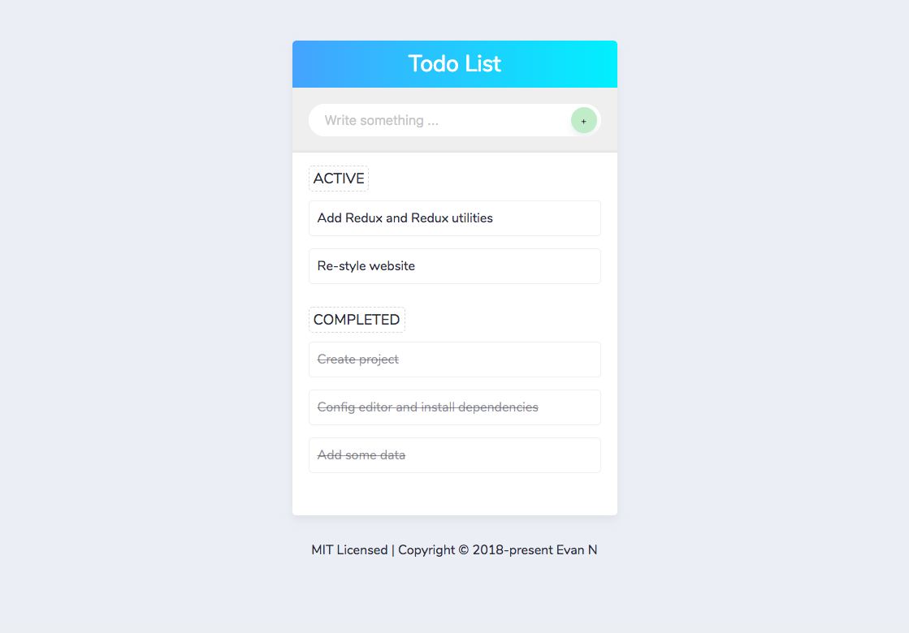

<p align="center">
  <a href="https://vuepress.vuejs.org/" target="_blank">
    
  </a>
</p>

# Todo List Example

> Advanced techniques for simple example

## Features

[x] Add todo

[x] Change todo status

[] Delete todo

[] Drag & Drop todo

[] ...v.v

## About

This is a starter boilerplate app I've put together using the following technologies:

- typescript
- react
- react-dom
- react-redux
- immutable
- recompose
- redux
  - redux-actions
  - redux-immutable
  - redux-thunk
  - reselect
  - redux-devtools-extension
- styled-components
- node-sass
- parcel-bundler
  - parcel-plugin-typescript
- prettier
- tslint
- shortid

## Installation

```
yarn
```

## Running Dev Server

```
yarn dev
```

### Using Redux DevTools

[Redux Devtools](https://github.com/gaearon/redux-devtools) are enabled by default in development.

- <kbd>CTRL</kbd>+<kbd>H</kbd> Toggle DevTools Dock
- <kbd>CTRL</kbd>+<kbd>Q</kbd> Move DevTools Dock Position
- see [redux-devtools-dock-monitor](https://github.com/gaearon/redux-devtools-dock-monitor) for more detailed information.

If you have the
[Redux DevTools chrome extension](https://chrome.google.com/webstore/detail/redux-devtools/lmhkpmbekcpmknklioeibfkpmmfibljd) installed it will automatically be used on the client-side instead.

If you want to disable the dev tools during development, set `__DEVTOOLS__` to `false` in `/webpack/dev.config.js`.  
DevTools are not enabled during production.

## Building and Running Production Server

```bash
yarn build
```

## Contributing

I am more than happy to accept external contributions to the project in the form of feedback, bug reports and even better - pull requests :)

If you would like to submit a pull request, please make an effort to follow the guide in [CONTRIBUTING.md](CONTRIBUTING.md).

## License

[MIT](https://github.com/vuejs/vuepress/blob/master/LICENSE)

---

Thanks for checking this out.

– Evan N, [@dacsang97](https://www.facebook.com/dacsang97)
